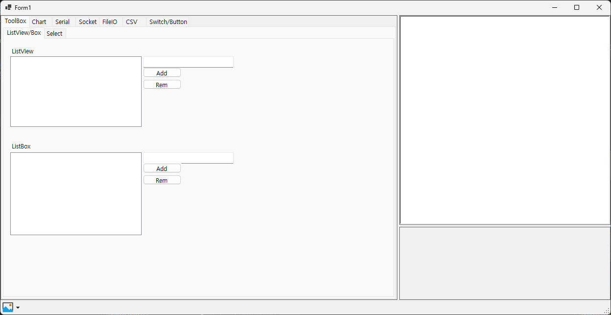

# CSharp_Common
This is for C# program function sample reference for copy/paste for work.

# Feature
- Chart
    - MS Chart
    - Need to install "WinForms.DataVisualization" from nuget
    - .NET framework uses chart as a default but in case of not .NET, need to install manually via nuget
- InvokeWrapper
    - Wrapper to avoid invoke error

# History
- 2024.11.21
    - First created
- 2024.11.25
    - MyLog class created : CMyLog
    - InvokeWrapper class created : CInvokeWrapper

# Environment
Tool : Visual Studio 2022 
Language : C# 
Target Framework : .NET 8.0 (Not .NET Framework) 

